# Web Projekat - Prodavnica Računara

<!-- bedzevi -->

Ovo je projekat za potrebe premeta "Web Programiranje" na trećoj godini Elektronskog Fakulteta u Nišu. Tema projekta je **prodavnica računara**,
odnosno nešto što podseća na **kontrolnu tablu** neke prodavnice računara.

## 📝 Obaveštenja
- Pre pokretanja dodati sve podatke u bazu: [`0 - SVE ZAJEDNO.sql`](https://github.com/xTeamStanly/WebProjekat-ProdavnicaRacunara/blob/main/Podaci/0%20-%20SVE%20ZAJEDNO.sql)
  - Ovaj sql upit je pravljen specifično za [Azure Data Studio](https://github.com/microsoft/azuredatastudio)
  - Zato je podeljen na delove od po maksimum 1000 _INSERT INTO_ operacija
  - Korišćen _connection string_ pokazuje na server `ProdavnicaRacunaraDB`, a baza se zove `ProdavnicaRacunara`
- Backend
  - .NET Core 5
  - [Entity Framework Core](https://www.nuget.org/packages/Microsoft.EntityFrameworkCore/5.0.12) (v5.0.12)
    - [Design](https://www.nuget.org/packages/Microsoft.EntityFrameworkCore.Design/5.0.12)
    - [SqlServer](https://www.nuget.org/packages/Microsoft.EntityFrameworkCore.SqlServer/5.0.12)

## 📖 O implementaciji

## 🧰 Primer rada (11 slika - neke slike su prilično velike)
  1. Ovako izgleda aplikacija kada se pokrene. Postoje instance tri radnje, pa je potrebno odabrati
     posebno svaku radnju. Sve prodavnice, odnosno njihova imena, se dinamički učitavaju iz baze i
     prikazuju u padajućoj listi.  
     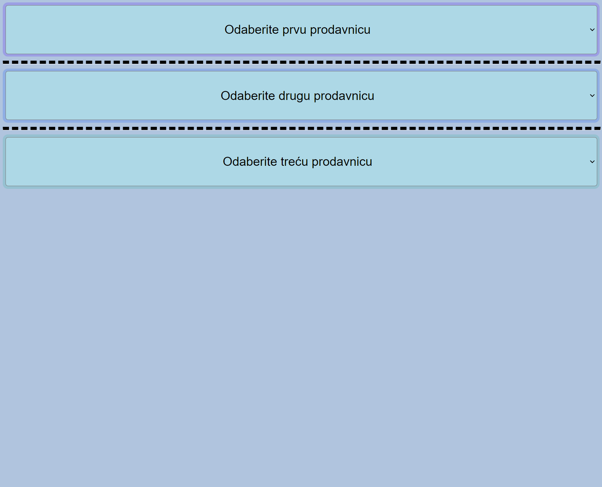

  2. Izbor prodavnice preko padajuće liste. Iz baze se pribavljaju informacije o odabranoj prodavnici i
     pamte se u lokalnoj promenljivoj unutar [`data.js`](https://github.com/xTeamStanly/WebProjekat-ProdavnicaRacunara/blob/main/Frontend/js/data.js) fajla. U njemu se nalaze promenljive za sve tri instance prodavnice.  
     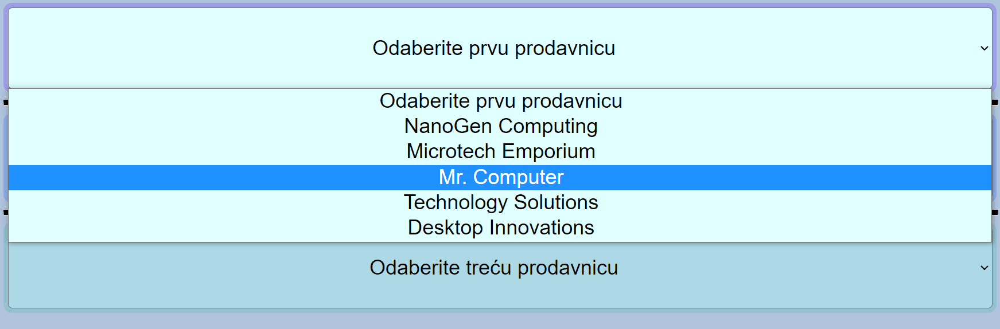

  3. Izgled glavnog menija aplikacije. Odavde možete odabrati bilo koju od opcija vezanih za
     prvu, drugu ili treću instancu prodavnice. Svaka instanca prodavnice ima drugačiju boju
     pozadine i odvojena je isprekidanom linijom kako bi se lakše razlikovale. U gornjem delu
     prostora za prodavnicu prikazane su informacije o istoj.  
     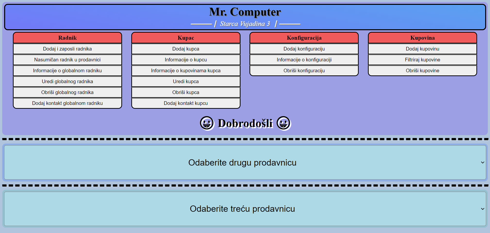

  4. Zarad demonstracije, odabrana je opcija `Nasumičan radnik u prodavnici`, rezultat te operacije
     je prikazan ispod menija. Taj odeljak za prikaz se zove `platno`.  
     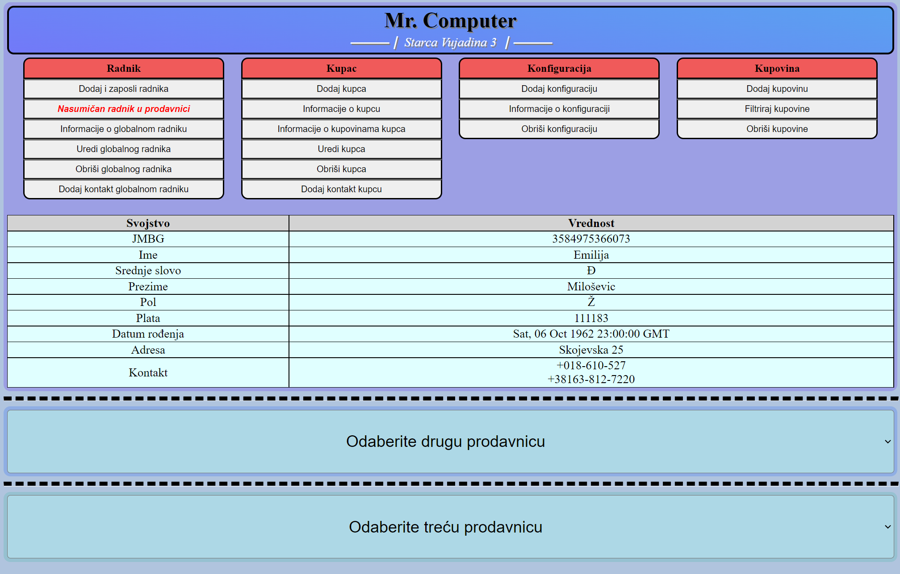

  5. Možemo odabrati drugu prodavnicu iz padajućeg menija namenjenog
     drugoj instanci prodavnice.  
     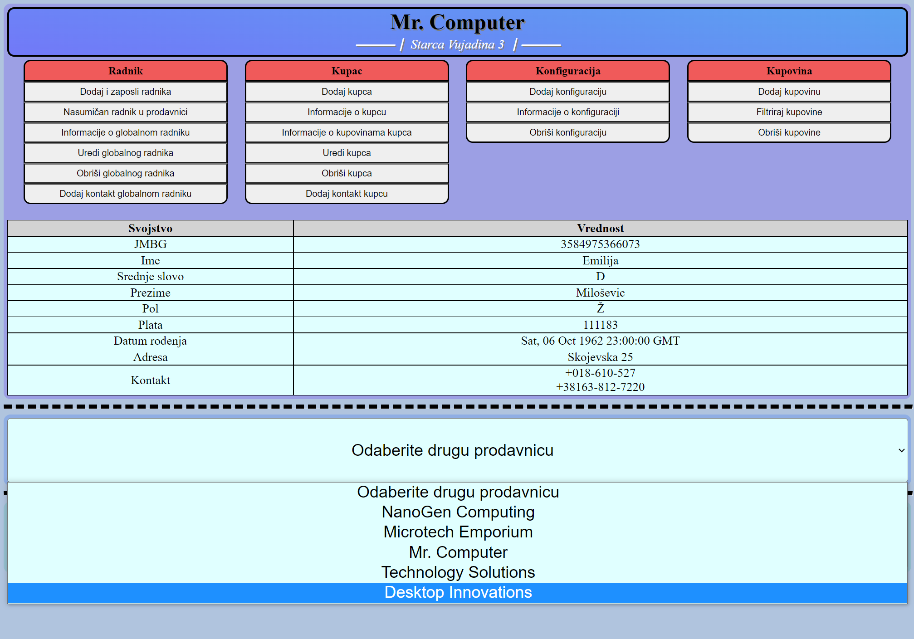

  6. Pojavljuje se meni za drugu instancu prodavnice. Zarad primera, odabrana je
     opcija `Dodaj kupca`. Posle odabira na `platnu` se iscrtava forma za dodavanje
     novog kupca u bazu podataka.  
     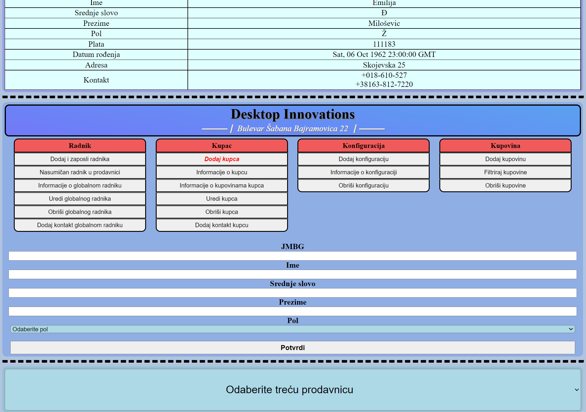

  7. Možemo odabrati treću prodavnicu iz padajućeg menija namenjenog
     trećoj instanci prodavnice.  
     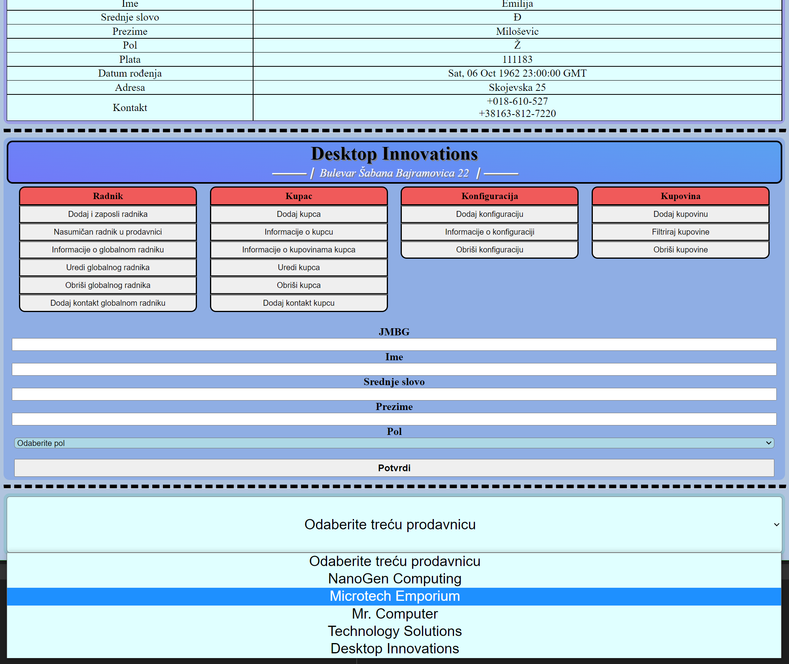

  8. Pojavljuje se meni za treću instancu prodavnice. Zarad primera, odabrana je
     opcija `Dodaj konfiguraciju`. Posle odabira na `platnu` se iscrtava forma za dodavanje
     nove konfiguracije u bazu podataka.  
     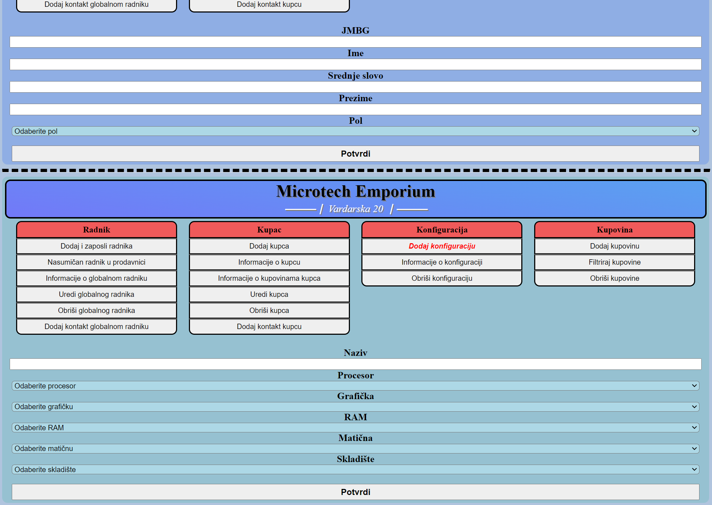

  9. Forma za dodavanje nove konfiguracije dinamički uzima moguće delove iz baze podataka
     i popunjava odgovarajuće padajuće liste tim delovima.  
     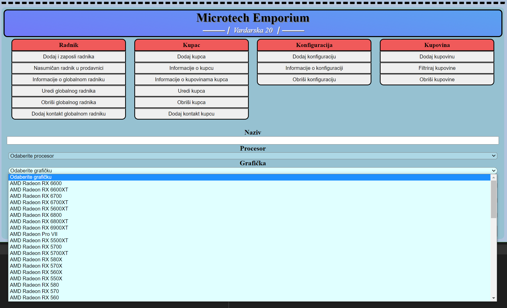

  10. Ovako izgleda aplikacija kada joj se dodeli veći, odnosno širi, prozor.  
      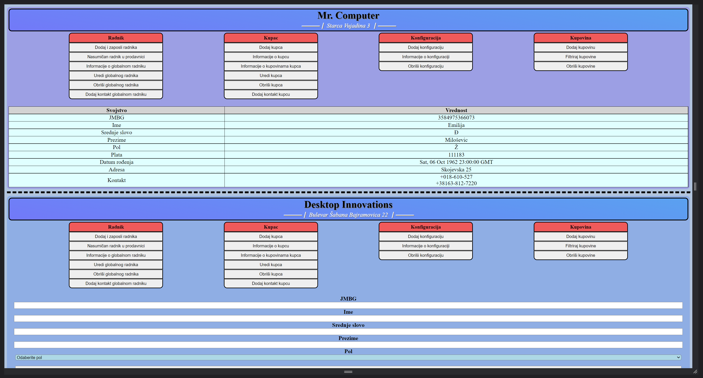

  11. Ovako izgleda aplikacija kada se nalazi u nekom užem prozoru, na primer
      mobilni telefon. Meni aplikacije je fleksibilan.  
      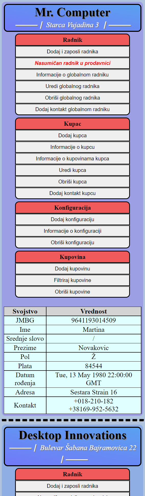

  12. Takođe prikaz delova konfiguracije je isto fleksibilan, ovako izgleda kada je razvučen.  
      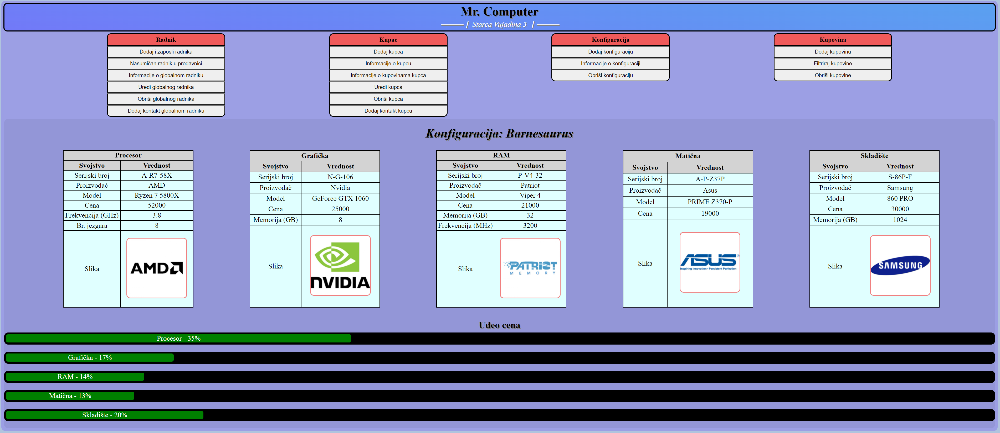

  13. Ovako izgleda prikaz delova konfiguracije kada je skupljen.  
      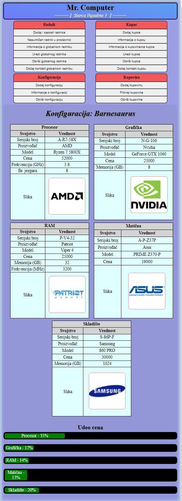
